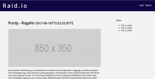

# Raid.io

Find the demo app at https://thomas-jonathan-capstone.herokuapp.com/

## the Application

Raid.io is a handy way to find, apply, create, and manage your FFXIV raid teams. You can get rid of all those messy google docs and spreadsheets and manage your team from a single application.

It streamlines the process of finding other players to join up with for raids. Currently there is no central hub for the hundreds of thousands of active players to do this.

Our MVP is targeted specifically at FFXIV players but in the future is easily expandable to a wide variety of MMOs.

## Design and Screengrabs

###Color Palette:

[color palette](demo/fullstack_capstone_palette.pdf)

###HTML Mockups:

[User Page Mockup](views/userpage.html)

[Sign Up Page Mockup](views/signup.html)

### Screengrabs

Current teams are listed on the homepage:

Signup for an account and add your player info:

Then apply to whatever team you like:

As a user you can view your profile:

And you can also manage your team:

Accepting members or rejecting them:

## the API
Our RESTful API has various endpoints that allow for the creation of a user(sign up), the querying of user and raid team data, and updating team
data.

### Get User Data:
Send an ajax request with a get method to **/user** to receive data on all users or to **/user/(specific user id)** to retrieve data on a particular user. User data will be returned as a json object with data

`{ id, username, discord, playerName{ firstName, lastName }, playerClass[ { className, level } ] }, team( if they're on one )`

id: User's unique database id
username: User's username
email: User's email
discord: User's discord username
playerName: First and last name of the User's in game character name
playerClass: The classes the User's character has leveled.

### Get Raid Data:
Similar to getting user data, but using **/raid** and **/raid/(specific raid id)**. Data returned will be in the format of

`{ id, name, leader, time, applicants[], members{ tanks[], healers[], dps[] } }`.

id: The raids database id
name: The name of the raid
leader: The user who is the leader/manager of the raid
applicants: People who are currently applying to the raid
members: People who are currently a part of the team, separated into role

### Creating a User:
Create an ajax request using a post method with data for username, password, discord screenname, email, player name, and player class
to the endpoint **/user** to create new user data in the database. The data for the created user will return as a json object.

### Managing a Raid:
Currently, the api allows for some light team management through three endpoints.

To add a user to a raid field, create an ajax request with a postmethod to **/raid/(raid id)/(field)/(user id)**.

To delete a user from a raid field, create an ajax request with a delete method to **/raid/(raid id)/(field)/(user id)**.

To add a user specifically to the applicants field, create an ajax request with a put method to **/raid/(raid id)/(user id)**.

## the Stack

* **The Front End**
  * Handcrafted HTML with artisanal CSS including a custom grid.
  * Modeled in React-flavored-jQuery with componentized rendering elements and unidirectional data flow.
  * Not currently as responsive as it should be...sorry 😢
* **The Back End**
  * Standard M E _ N stack setup.
  * Mongo instance hosted on mLab with Mongoose for object modeling.
    * Also used Faker extensively for creating test data.
  * An Odyssian Express router journey littered with the corpses of abandoned endpoints.
  * Mocha and Chai for testing.
  * Authentication soon to be deployed with Passport.
  * All built in Node and hosted in Heroku with Travis for CI.
* **Dev Process**
  * Pretty simple tooling:
    * Atom & Postman for most everything.

## Lessons Learned

* **Process, Planning, Development, Coordination**
  * Plan moar
  * Use simple, working solutions first, only refactor when it works
  * Map out in advance a strict endpoint format
* **Development and Technology**
  * Cons:
    * jQuery really starts to feel cumbersome and hard to manage state.
    * Using Mongo--even simple data relations get very tricky to interact with, even with Mongoose.
* **Next Steps**
  * Flesh out auth and login process.
  * Implement more of the backend features into the front end.
  * Once that is fleshed out, there is a lot more data that we can add to our objects.
